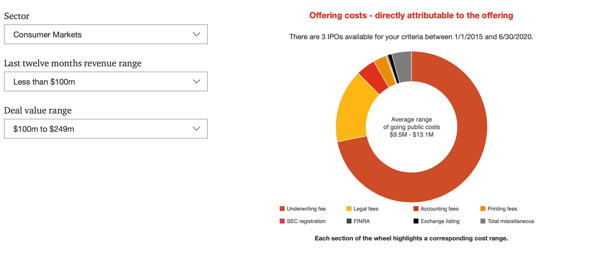

# Why companies care about their stock price

Have you ever wondered why that is that when shares of a publicly-traded company fall, the company tends to fight back? Its CEO posts a tweet about a wonderful new idea that will be turned into reality in the near future, about the stunning quarterly results that they expect to report or about the wonderful culture that the company is proud of.
Would such behaviour be exhibited if the company wouldn't care about the stock price? Probably not. And yet, it is not really obvious why should they care. They don't have a direct profit from the price rallying, after all, at least not in the same way the investors do.

Even though I already know a thing or two about the stock market and its inner workings, I've recently realised that despite being an investor myself, I don't really understand how a company benefits from its market capitalization. In this article, I'd like to elaborate on why the stock price is important for a company, what implications it might have if the stock price falls (or rises) significantly and in general, to explain the connection between the stock price and the company capital.

Credit: <a href="https://unsplash.com/collections/88368885/stocks">Isaac Smith</a>

## Going public

Usually, the company is not publicly-traded right ahead. Instead, it begins with a process called **initial public offering (IPO)** through which a private company becomes a publicly-owned entity. There are various reasons for going public and it comes with both advantages as well as disadvantages. Let's talk about this bit first to understand the motivation behind going public.

I wouldn't be surprised if you already knew that a company decides to become publicly traded in order to raise capital. That is the primary reason to go public in general. But do you know *how* it raises the capital? How the IPO works anyway? What determines the initial price of the shares. It was not immediately obvious to me. In a nutshell, when a company decides to go public, it contacts an investment bank that will facilitate the IPO. The firm has to undergo a thorough analysis, which is usually conducted by the investment bank, in order to determine its valuation. The valuation is a theoretical limit to the initial market capitalization and can therefore be used to estimate the initial amount of shares to start with.
This can be a challenging process, however. We don't need to get into specifics, but there are some generally followed practices when it comes to the initial share price. Usually, each stock won't be worth more than $10. That way, retail investors can easily buy a piece of your company without having to invest a great amount of their money. The stock can be worth pennies and increase over time. 
Choosing the number of shares depends on the future valuation of the company. For example, if the company believes it will be worth $1 million in the future, it might file for authorization of 100,000 shares and value each of them for $10. The other thing is that usually, the company **issues to the public only a portion of the authorized shares**. These are often called **shares outstanding**, or **the float**, in the market lingo. That way, the company can issue more of its authorized shares in the future, it might sell it for excess cash or they can be used in the company stock option plans like ESPP (Employee stock purchase plan). To continue in the example, the company may offer 50,000 shares in an IPO, give out 10,000 to the executives and keep the remaining 40,000 **in its treasury**. If the company does very well and the shares double in price in a year, the company may **raise another capital** by selling 10,000 of its treasury shares or **buy back the outstanding shares**, effectively lowering the number of shares outstanding. The latter effect is often regarded as a bullish sign and the market reacts by raising the price even more.

Apart from raising capital, there are other advantages of being a publicly-traded company.
One such which I personally take notice of and I consider it to be quite a significant benefit, especially in these volatile days where businesses struggle to stay afloat. That advantage is increased public awareness of the company, interest in the company and its products and sort of a change in the prestige of the company. Imagine a startup company in the tech sector which files for IPO and gets listed on the NASDAQ. Doesn't it immediately raises your trust level in that company? I mean they've got to be serious about the business if they make it to NASDAQ, don't they?
Not to mention that IPOs provide an exit strategy for the venture capitalists and angel investors and put more control &mdash; well, and also less, but that might be a long discussion &mdash; in the hands of the founders.
Remember, we're taking the perspective of the company right now, there would be additional points to mention should we take the perspective of investors instead.

Finally, the last advantage I am going to mention which in my opinion shouldn't be left out of this comprehensive list is the **impact of the public perception on the company**. Particularly, the company *very* quickly receives feedback &mdash; positive or negative &mdash; on their products, on its recent moves. It keeps the company awake and sharp, forces it to do proper accounting and the stock price and stock options are also motivation factors for the employees and hirees. Arguably, all of these points can also be disadvantages. Let's discuss the cons of being a publicly-traded company next, shall we?

Now that we mentioned some of the major advantages, we should take a look at the other side of the coin. What probably surprised me the most was all the hassle around it and what is the actual **cost of a private company going public**. [There is a great summary](https://www.publicfinancial.com/what-does-it-cost-to-go-public) of what the actual costs are. It of course largely depends on the size and complexity of the company, but the example presents a general early-stage company which, can complete a direct listing or direct public offering for <q>as low as $125,000, plus stock</q> (or $200,000 in cash) when a specific milestone is achieved. Moreover, that would be listing on the OTC QB, something like NASDAQ would be significantly higher. I mean... that's a good chunk of cake, but that is really just <q>as low as...</q>. In a [detailed overview](https://www.pwc.com/us/en/services/deals/library/cost-of-an-ipo.html) provided by PwC, where they take the costs from SEC filings for US IPOs ranging from 2015 &mdash; 2020, you can expect the **average range of going public costs for a company which has less than $100M in revenue to range from $9.5M to $13.1M**!

If you're interested in reading what these fees are, I encourage you to read [the linked assessment by PoW](https://www.pwc.com/us/en/services/deals/library/cost-of-an-ipo.html).
Also, bear in mind that the costs are not just the matter of the initial public offering. There are accounting costs, legal costs and plethora additional expenses from now on.

The other thing is that from now on (assuming the company is already publicly-traded), it is a subject of various macroeconomic events.
The recent history has provided us the evidence of exactly that phenomenon, in which basically the whole market swiftly pulled back. The market did not go easy on anyone and the market-wide drops ranged from 10% to 80% over a period as short as one month. That could be devastating under some unfortunate circumstances.

At last, to be fair and have at least three examples of each, it should be mentioned that there is non-negligible impact of the pressure on the management and leadership of a public company. Whether the price is going up or down, they can't turn a blind eye to it. Afterall, there might be (and usually is) a rational behind the price moving it pays off to pay attention to what investors and the general public think.
Putting aside predictable events like earnings, stock splits and dividend adjustments, one of the reasons of a price changing swiftly might be a disruption in the competitive space. Like a major competition entering (or leaving) the market and investors appreciating the opportunity. Especially the former may be a great pain for the management and they have to put up with it accordingly.
On the other hand, it is often the case that the market is dragged down by macroeconomic events. As a result, the company's stock might drop as well and even more if it's in the epicentre of that event. It is the CEOs who are usually bound to react to such conditions. We can see them posting on social networks at an increased rate, we can see them defensively buying shares to showcase their trust in the company. Behind the curtains, however, they have a lot to deal with both on the investor side and employee side of things. Neither of them are happy when the stock price falls.

Credit: <a href="https://unsplash.com/collections/88368885/stocks">Markus Spiske</a>

## When the stock price matters

And here comes the main question of this article. Should a publicly-traded company care if its stock price falls or raises (yes, we should *always* consider upwards as well as the downwards direction)? If so, when does the stock price matter and why?
Now that we already know some of the pros and cons of being public, let's use that knowledge to assemble a list of items that are correlated to the increase in stock price:

- financial health indicator
- company prospects (earnings, growth, performance)
- public awareness
- prestige
- shareholder satisfaction and employee moral

Arguably, all of these things are positively correlated. Meaning that with a growing stock price, the company prospects also raise as people expect positive earnings and growth of the company. The contrary is also true. Now, let's put together another list of possible reasons a stock price might be of interest for the company.

- monetary interest in the company
- salary incentives (stock options)
- takeover prospects and potential for acquisitions
- additional capital raise

That is by no means a complete list, but it might give you a rough idea. You'll understand even more when we dive into each of these points a little deeper.

As far as **monetary interest in the company** I mean shareholders, owners and company employees alike. It is often the case that higher management has a stake in the company, is rewarded by shares (quarterly, yearly or as a gesture of appreciation for their work). Some CEOs also take a significant part of their **salary** in shares. For that reason, they have an **incentive** for the price to go up and might be discouraged from their work if it's not happening for a longer period of time. Similarly, shareholders might feel like the company might be financially struggling or not doesn't have enough growth behind it and might be inclined to sell out or lower the stake in the company. That might again be troubling because it is much more easier to make business decisions when the shares are closely held, all the more if familiar investors have the majority of shares.

It is quite similar with **salaries and stock options**. The lower the share price, the more difficult it is to pay employees and award the shareholders. In case of salaries, there are usually two scenarios that might play out &ndash; the company has to give a bigger chunk of their stock to maintain the compensation level relatively stable (not very common, also not very motivating), or the employee will just have a lower salary.
With regards to the stock options, that's a tricky concept as well. If the share price drops and stays below the strike price of the employee stock options, they become essentially *worthless*. That is a very bad sign for the company and it might loose the precious talent that way very easily.
Considering the opposite, usually there's nothing bad about the share price going up, obviously. But, in some specific employee stock purchase plans, temporarily elevated share prices are usually not helpful either as far as stock options are concerned since the amount of shares the employee receives is smaller and there is a potential that it depreciates. We can see this volatility especially in early startups and it is why I think it's arguable whether it's really wise to join a startup just because of the employee stock options plan like some people do. Companies which has just been publicly listed &mdash; and are therefore susceptible to a higher volatility &mdash; are quite often over-hyped after their IPOs and when the hype is over, the sudden drop in share price might demotivate employees.

When the shares are dropping, it also increases the probability of a <q>bigger shark</q> starting to circle around, wanting to seize a fat chunk of the company. The company is now in danger of a **takeover**. That of course may or may not be good for the company, depending on the situation. In most cases, however, it's not a good sign. On the other hand, when the stock price goes up, it makes it easier for the company to complete **acquisitions** of other companies via their shares. **Raising additional capital and refinancing** also becomes much easier. The higher the valuation (which is the market capitalization) of the company, the easier it becomes to raise a reasonable amount of money.

## Conclusion

When I first started to thought about why some of the CEOs almost immediately step up when the market is getting medieval on their... well, stock, I wasn't completely able to see the whole picture. In fact, it would even come as a surprise to a certain extent, because hey... they're not loosing the money, I am! Right? But the reality is a bit different.

In this article I've described how a falling &mdash; and even a booming &mdash; stock prices can affect the market not only in the short term, but even in the long run. After reading the article, you should understand the IPO process, the process of going public and of raising a capital for the company. You should also understand the incentives of shareholders, employees and other stakeholders.

So from now on... whenever you're terrified about the price of a stock you own drowning in the sea of blood &mdash; as it is unnecessarily often the case these days &mdash; there is at least one thing that can comfort you. You're not the only one panicking. And there might be a prompt response comming.