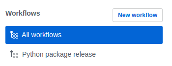
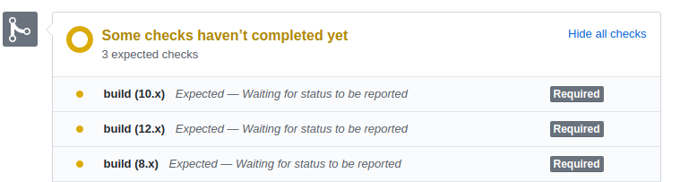

# Guide to a custom CI/CD with GitHub Actions
## Part 1: Workflows

<br>

CI/CD is a set of practices which have a significant impact to the way new releases are delivered and maintained. Change validation by creating a build and running automated tests, continuously releasing and delivering the changes to the customers in a sustainable are the practices which distinguish a well-maintained code from just ... a code.

In this article we'll take a look at how you can easily create your very own CI/CD pipeline in just a few minutes using the newly opened [GitHub Actions]. We can make any *workflow* (which is a more GitHub-compatible way to put it) a part of status checks which will be ran on each PR, issue, or any defined event, really.
This guide will walk you through a simple workflow which **publishes Python packages to PyPI**

If it sounds like something interesting, keep going, it's going to get even better.

## Advantages over existing CIs

The first thing that you might want to ask right away is: *"What's the big deal about these Actions that should make me migrate my CI to GitHub?"* Frankly, decisions about migrations are always complicated so let's put them off for a while now and focus on a scenario when you're setting up a new repo and you feel sorry hitting Travis so hard with your 98% code-covered tests.

### Environment

First thing that comes to mind, obviously, is the native **integration** with GitHub. Which means, that your CI is no longer decoupled from the source. But it doesn't end there. GitHub creates a so called [*virtual environment*](https://help.github.com/en/articles/virtual-environments-for-github-actions) which it populates with [environment variables](https://help.github.com/en/articles/virtual-environments-for-github-actions#environment-variables), like:

| Environment variable    | Description |
| --------------------    | ----------- |
| GITHUB_WORKFLOW	      | The name of the workflow. |
| GITHUB_REPOSITORY       | The owner and repository name. For example, octocat/Hello-World. |
| GITHUB_EVENT_NAME | 	The name of the webhook event that triggered the workflow. |
| GITHUB_WORKSPACE        | The GitHub workspace directory path. The workspace directory contains a subdirectory with a copy of your repository if your workflow uses the actions/checkout action.<br>**If you don't use the actions/checkout action, the directory will be empty**. |
| GITHUB_REF              | The branch or tag ref that triggered the workflow. For example, refs/heads/feature-branch-1. If neither a branch or tag is available for the event type, the variable will not exist. |

and more ...

### Secrets

Managing secrets is pain. It always has been. But GitHub Actions make it much much easier! You can set **per-repository secrets** in the repository settings and then just use them freely in your Workflows or feed them as arguments to the Actions. GitHub takes care of hiding the secrets in the log as well, so you don't have to worry about that either.

For example, a typical use case is providing an **API token**. You may create a secret for that as well, if you require a special set of permissions for that token, however there is one already prepared for you which grants all the repository-related permission that you need.
This secret is implicitly created for each repo and is called `GITHUB_TOKEN`.

You may then access it as `${{ secrets.GITHUB_TOKEN }}` (more about the [Workflow syntax for GitHub Actions] later).

## Workflow

A **Workflow** is a set of **jobs** which consist of **steps**. Jobs run in parallel by default, but we can also specify a hierarchical structure (an [example](#jobs-hierarchy-example) below).

<a name="jobs-hierarchy-example">Example</a>:
```yaml
jobs:
  # a parent job
  tests: {}

  # a child and a parent
  release:
    needs: [build, tests]

  # a child
  deployment:
    needs: [release]
```

> **NOTE:** Each job runs in a fresh instance of the virtual environment specified by runs-on.

Unless specified otherwise, parent jobs must complete successfully in order for the child jobs to run.

### Python package release workflow
Let's start defining a simple workflow. We'll want to **publish a Python package to PyPI**. Quite a common use case which gets very annoying over time.

> **NOTE:** This workflow will serve for illustration purposes. You can make use of the existing [**Python Release action**]() which takes care of the **whole release process** for you in a single step. See further.

#### Creating a workflow file

Let's create a file in your git repository under `./github/workflows/` called `package-release.yml`. It is important to use the `yml` suffix as GitHub expects it.

Start with a name of the workflow

```yaml
# @file package-release.yml
---
name: Python package release
```

From now on, you'll see the workflow under your Workflows:

<p align="center">
  
  <br>
	<span style="font-size:small;">
    Workflows overview
	</span>
</p>


#### Workflow triggers

We probably want to trigger this workflow only on certain *events*. You can configure your workflows to run when specific activity on GitHub happens, at a schedule time, or even when an event outside of GitHub occurs!.

There is plethore of [Events that trigger workflows
](https://help.github.com/en/articles/events-that-trigger-workflows#scheduled-events) to choose from. However, we are interested in a particular one -- in the [release](https://help.github.com/en/articles/events-that-trigger-workflows#release-event-release) event.

```yaml
on:
  release:
    types: [created]
```

#### Defining jobs

We'll only have one job here -- release. We don't want to split it into multiple jobs, since the environment is not preserved anyway, hence there would be no benefit in doing so.


Initialize the workflow with the two following steps:

```yaml
jobs:
  release:

    # specify the instance
    runs-on: ubuntu-latest

    steps:
    # checkout the repository to master
    # and use it as the current working directory
    - uses: actions/checkout@v1
    - name: Setup Python
      uses: actions/setup-python@v1
      with:
        python-version: "3.6"
```

What happened here? What you see above are what we call the *actions*. These are pre-defined workflow steps, either by yourself or someone else. In this case, the `actions/` is an official GitHub repository, but if you used mine, for example the release action that I mentioned in the comment above, you would have to write `uses: cermakm/python-release-action@master` (or any other existing ref). We'll take a look at how these actions are created in the next part of this post.

The `actions/checkout` is necessary if you want to use the content of your repository. It mounts it to the current working directory and also sets up the `GITHUB_WORKSPACE` environment variable. The `actions/setup-python` is pretty self-explanatory.

> Whenever an action accepts arguments, you can provide them using the `with` key.

Let's proceed to the next steps of your release workflow.

```yaml
    - name: Install dependencies
      run: |
        python -m pip install --upgrade pip

        pip install .
        # release and testing dependencies
        pip install twine flake8

    - name: Lint with flake8instance
      run: |
        # stop the build if there are Python syntax errors or undefined names
        flake8 . --count --select=E9,F63,F7,F82 --show-source --statistics
        # exit-zero treats all errors as warnings. The GitHub editor is 127 chars wide
        flake8 . --count --exit-zero --max-complexity=10 --max-line-length=127 --statistics

    - name: Build Python package
      run: |
        python setup.py sdist bdist_wheel
    
    - name: Twine check
      run: |
        twine check dist/*
        
    - name: Publish to PyPI
      run: |
        twine upload --repository-url https://upload.pypi.org/legacy/ dist/* -u ${{ secrets.PYPI_USER }} -p ${{ secrets.PYPI_PASSWORD }}
```

The `run` is a special keyword which allows you to execute custom shell script.

>If you need a special `shell` to run the script in, you can provide it as `shell` key.

I like to run linters before the release as well, you may also run include tests and other checks here as well (but these should be always done on pushes and PRs anyway!)

Finally, the `twine` uploads the package to the PyPI repository using credentials provided as **secrets**. Make sure these secrets are defined in the repository you're publishing.

Now whenever we create a tag and push it to the remote, it will get published to the PyPI.

The whole workflow looks like this:

```yaml
# @file package-release.yml
---
name: Python package release

on:
  release:
    types: [created]

jobs:
  release:

    # specify the instance
    runs-on: ubuntu-latest

    steps:
    # checkout the repository to master
    # and use it as the current working directory
    - uses: actions/checkout@v1
    - name: Setup Python
      uses: actions/setup-python@v1
      with:
        python-version: "3.6"
    - name: Install dependencies
      run: |
        python -m pip install --upgrade pip

        pip install .
        # release and testing dependencies
        pip install twine flake8

    - name: Lint with flake8instance
      run: |
        # stop the build if there are Python syntax errors or undefined names
        flake8 . --count --select=E9,F63,F7,F82 --show-source --statistics
        # exit-zero treats all errors as warnings. The GitHub editor is 127 chars wide
        flake8 . --count --exit-zero --max-complexity=10 --max-line-length=127 --statistics

    - name: Build Python package
      run: |
        python setup.py sdist bdist_wheel
    
    - name: Twine check
      run: |
        twine check dist/*
        
    - name: Publish to PyPI
      run: |
        twine upload --repository-url https://upload.pypi.org/legacy/ dist/* -u ${{ secrets.PYPI_USER }} -p ${{ secrets.PYPI_PASSWORD }}
```

### Examining the workflow

All workflows can be found in the `Actions` tab in your repository, i.e. `https://github.com/<owner>/<repository>/actions`. You can follow the logs real-time or download them as archives. You may have also noticed the `Checks` tab on a `Pull Requests`. These are the workflows that have been ran for the current PR and that contain status checks.

### Note on status checks
If you wish your workflow to block a PR from being merged, you can set [branch protection rules](https://help.github.com/en/articles/defining-the-mergeability-of-pull-requests) and if the workflow fails, the PR will not be able to be merged. This is the behaviour that you might be used to when working with the current CIs.

For example, having a NodeCI matrix setup:

<p align="center">
  
  <br>
	<span style="font-size:small;">
		GitHub Actions as status checks
	</span>
</p>

## Marketplace

Developers may publish their actions to the [Marketplace](https://github.com/marketplace?type=actions). Most of the actions are **free** so feel free to check it out and see if there is anything that you find useful for your development.

In the next part of this article, we'll explore how we can create our own Actions, use them in the workflows and and publish them to the Marketplace.

## Conclusion

There are obviously some insufficiencies and few features are still missing --- you can't, for example, delete old workflow runs --- but I believe that since the beta has been opened quite recently, all of these will be got rid of in the future.

GitHub Actions provide huge versatility and the integration is almost seamless. I am just impressed. That's it... you should check GitHub actions for yourself, create a workflow of your own and see whether/how it improves your current development life cycle.


<!-- References -->

[Workflow syntax for GitHub Actions]: https://help.github.com/en/articles/workflow-syntax-for-github-actions
